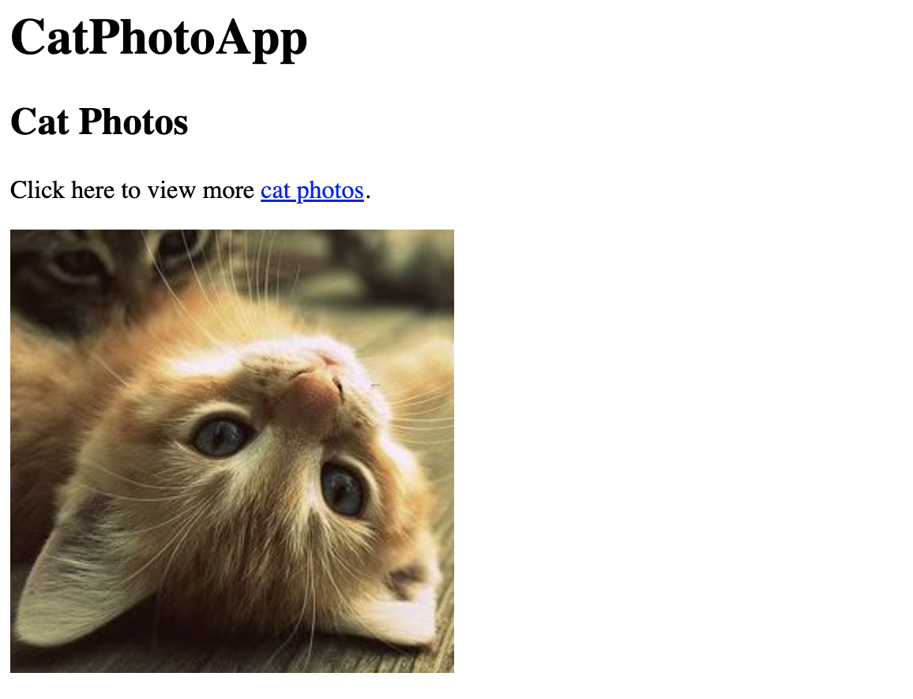

# 1. Cat Photo App

## Introduction

Cat Photo App is made using HTML only. It showcases the use of images, numbered list, unordered list, responsive web design features such as forms, URL submit button, and clickable links.

## Files 

README.md (this file)

[**index.html**](index.html)

* This file is in the root folder and contains the HTML file

  

## Features

Screenshots of the Cat Phoeo App are below.

## References

"CatPhotoApp" is the 1st project from FreeCodeCamp's Responsive Web Design course.  [FreeCodeCamp Responsive Wed Design](https://www.freecodecamp.org/learn/2022/responsive-web-design/)

